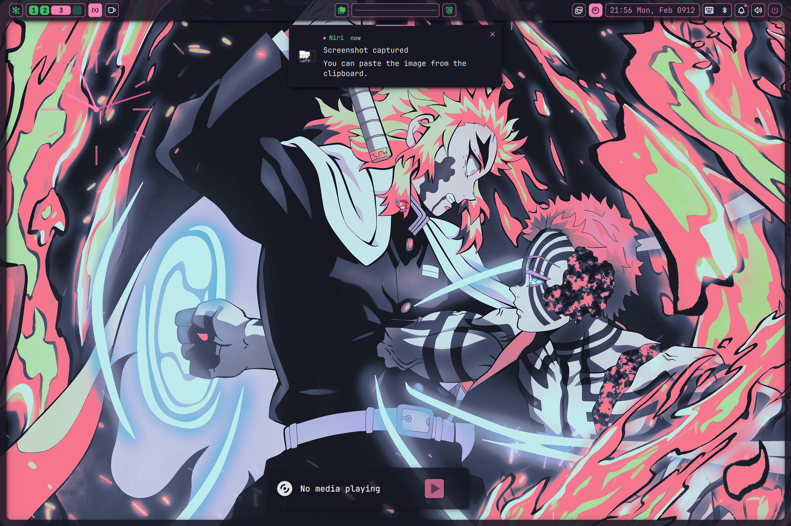
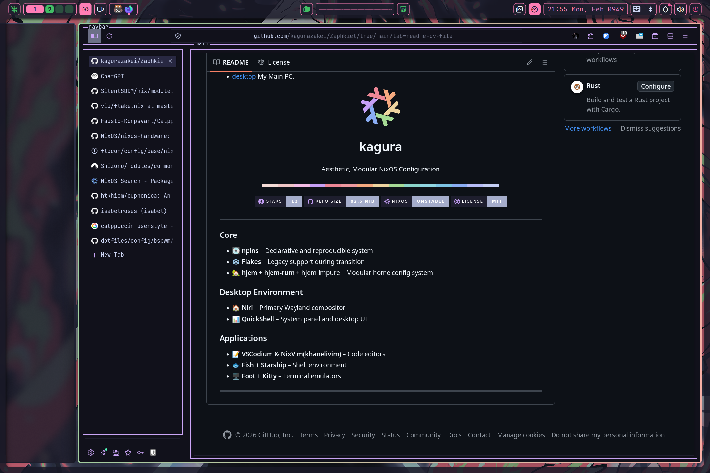
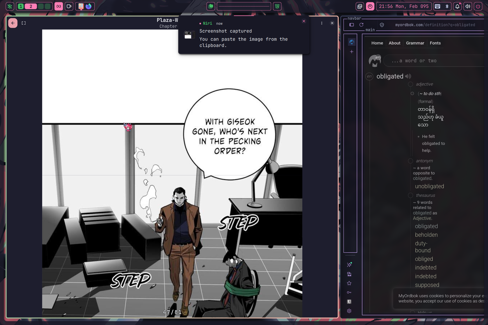
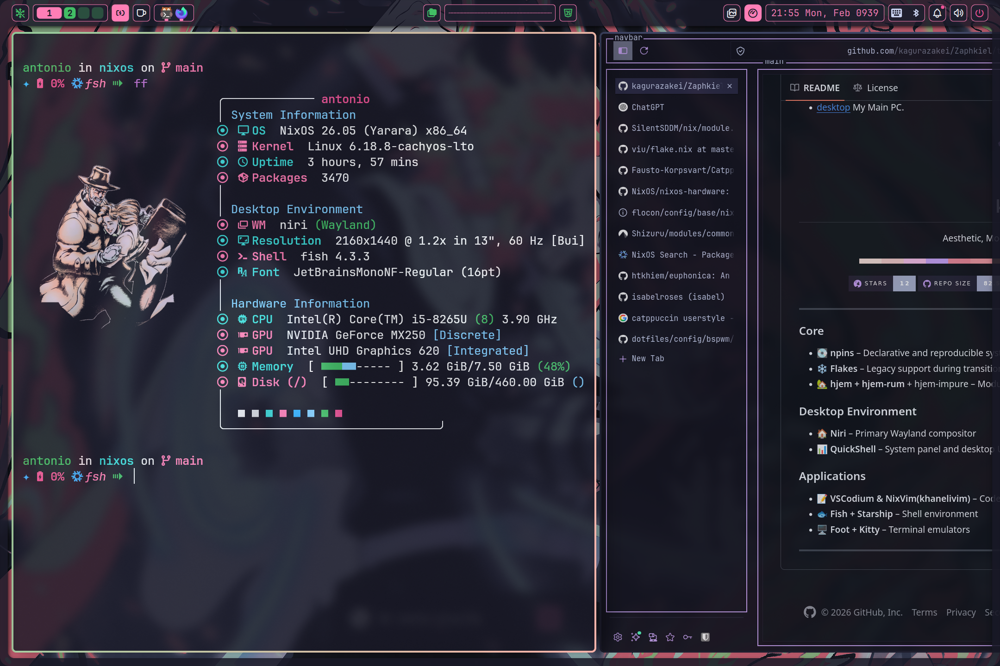
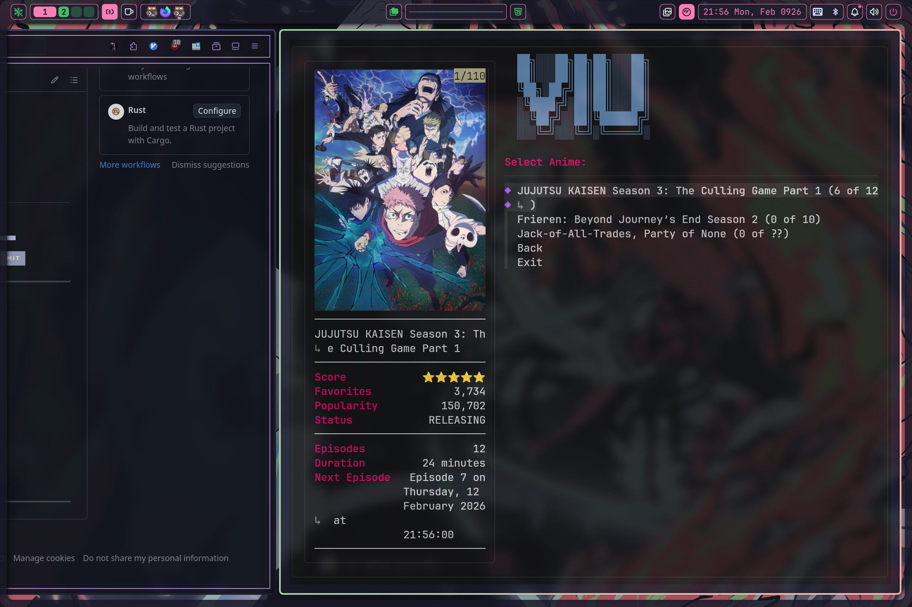

# My NixOS Repository

- [hana](https://github.com/kagurazakei/Zaphkiel/blob/main/hosts/hana/configuration.nix): The configuration for my laptop.
- [desktop](https://github.com/kagurazakei/Zaphkiel/blob/main/hosts/desktop/configuration.nix) My Main PC.

  
  <h1 align="center">kagura</h1>
  
Aesthetic, Modular NixOS Configuration

  

---

### Core

- 💽 **npins** – Declarative and reproducible system
- ❄️ **Flakes** – Legacy support during transition
- 🏡 **hjem + hjem-rum** + hjem-impure – Modular home config system

### Desktop Environment

- 🏠 **Niri** – Primary Wayland compositor
- 📊 **QuickShell** – System panel and desktop UI

### Applications

- 📝 **VSCodium & NixVim(khanelivim)** – Code editors
- 🐟 **Fish + Starship** – Shell environment
- 🖥️ **Foot + Kitty** – Terminal emulators
- 🦊 **Browser ** – Firefox Nightly
- 👾 **Viu** – Viu For Anime Media
- 🥭 **Manga Reader** – Komikku For Manga Reader
---

### Main Desktop

  

### Browser

  

### Manga Reader

  

### Terminal Related

  

### Viu for anime watching

  

